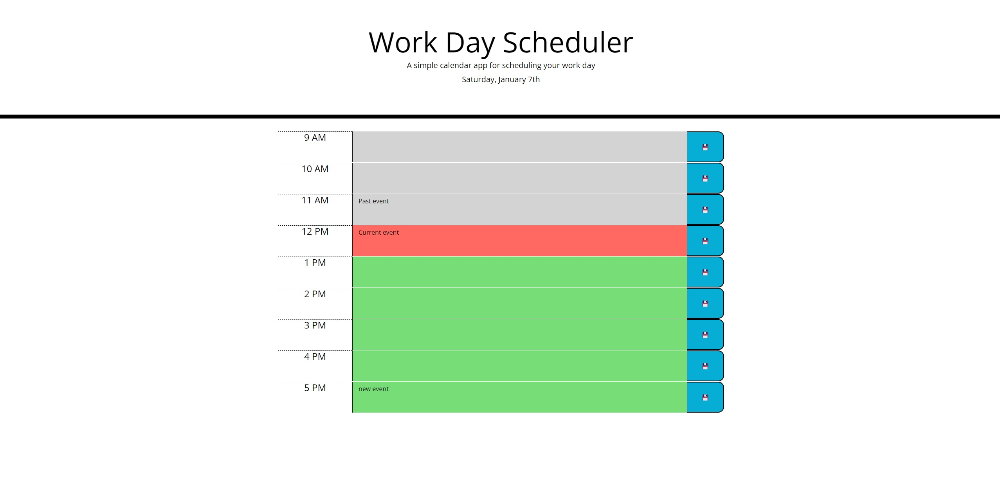

# Module 5 Challenge - Work day scheduler

## Description
This repository contains the module 5 challenge. The challenge consists of various acceptance criteria as mentioned below 
GIVEN I am using a daily planner to create a schedule 
WHEN I open the planner 
THEN the current day is displayed at the top of the calendar 
WHEN I scroll down 
THEN I am presented with time blocks for standard business hours 
WHEN I view the time blocks for that day 
THEN each time block is color-coded to indicate whether it is in the past, present, or future 
WHEN I click into a time block 
THEN I can enter an event 
WHEN I click the save button for that time block 
THEN the text for that event is saved in local storage 
WHEN I refresh the page 
THEN the saved events persist 

## Usage
To use the application go to following link https://note-app-111.herokuapp.com/
The image bellow shows the screenshot of the app
